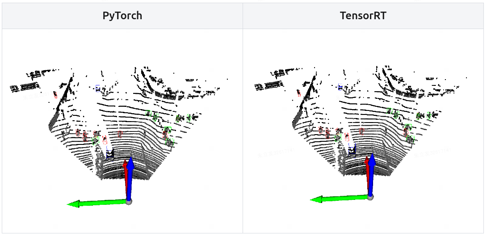

## 0. Introduction

#### 0.1 Supported features
- [X] PyTorch2ONNX (Support dynamic axes)
- [X] ONNX2TRT (Support dynamic axes)
- [X] TRT Inference (Support dynamic axes)
- [X] Complete TRT/C++ detection pipline (including voxelizaion and post-processing)
- [X] Voxelization acceleration with CUDA
- [ ] Code unification with the main branch

#### 0.1 Performance



Similar detection results between PyTorch, ONNX and TRT inference are achieved. Detection results validated on val/000134.bin are summarized in `infer_results`. My experimental environment is as follows, (however, TensorRT >= 8 and the corresponding CUDA are recommend for supporting `ScatterND`)
- `GPU`: RTX 3080
- `CUDA`: 11.1
- `TensorRT`: 7.2.3.4

    |  | Voxelization (ms) | Inference (ms) | PostProcessing (ms) | Total (ms) |
    | :---: | :---: | :---: | :---: | :---: |
    | PyTorch | 5.78 (CUDA) | 17.15 | 4.45 |  27.39 |
    | ONNX | 5.66 (CUDA)| 15.82 | 2.64 | 24.13 |
    | TensorRT | 226.63 (C++) | 20.6 | 0 | 248.87 |
    | TensorRT(FP16) | 241.27 (C++) | 14.02 | 0 | 256.91 |
    | TensorRT | 5.07 (CUDA) | 18.15 | 0 | 24.56 |
    | TensorRT(FP16) | 5.11 (CUDA) | **12.15** | 0 | **18.51** |
    


## 1. PyTorch2ONNX

#### 1.1 PyTorch2ONNX

```
cd PointPillarsPointPillars/ops
python setup.py develop

cd PointPillars/deployment
python pytorch2onnx.py --ckpt ../pretrained/epoch_160.pth
```

#### 1.2 (Optional) ONNX inference

```
cd PointPillars/deployment
python onnx_infer.py --pc_path ../dataset/demo_data/val/000134.bin --onnx_path ../pretrained/model.onnx
```

#### 1.3 (Optional) Comaprison to Pytorch inference

```
cd PointPillars/deployment
python pytorch_infer.py --ckpt ../pretrained/epoch_160.pth --pc_path ../dataset/demo_data/val/000134.bin
```
## 2. ONNX2TRT
#### 2.1 ONNX2TRT
```
/your_path/TensorRT-7.2.3.4/bin/trtexec --onnx=../pretrained/model.onnx --saveEngine=../pretrained/model.trt \
--minShapes=input_pillars:200x32x4,input_coors_batch:200x4,input_npoints_per_pillar:200 \
--maxShapes=input_pillars:40000x32x4,input_coors_batch:40000x4,input_npoints_per_pillar:40000 \
--optShapes=input_pillars:5000x32x4,input_coors_batch:5000x4,input_npoints_per_pillar:5000
```

#### 2.2 TRT inference
```
cd PointPillars/deployment/trt_infer
mkdir build 
cd build
cmake ..
make

./trt_infer your_point_cloud_path your_trt_path
e.g. 
./trt_infer ../../../dataset/demo_data/val/000134.bin ../../../pretrained/model.trt
```


## 3. Encountered problems
1. **INVALID_ARGUMENT: getPluginCreator could not find plugin ScatterND version 1**

    **Solution:** compile ScatterND plugin in TensorRT 7.2.3.4, which is supported in TensorRT >= 8.
    ```
    ## 1. Download TensorRT OSS
    git clone -b main https://github.com/nvidia/TensorRT TensorRT
    cd TensorRT
    git checkout release/7.2
    git submodule update --init --recursive

    ## 2. Add ScatterND plugin
    #### 2.1 Download scatterPlugin
    Download scatterPlugin from https://github.com/NVIDIA/TensorRT/tree/release/8.0/plugin/scatterPlugin, and then 
    mv scatterPlugin TensorRT/plugin
    #### 2.2 update plugin/InferPlugin.cpp  
    add line #include "scatterPlugin.h"
    add line initializePlugin<nvinfer1::plugin::ScatterNDPluginCreator>(logger, libNamespace);
    #### 2.3 update plugin/common/kernels/kernel.h
    add line pluginStatus_t scatterNDInference(cudaStream_t stream, int* outputDims, int nOutputDims, int sliceRank, int nRows, int rowSize, int CopySize, int sizeOfElementInBytes, const void* index, const void* updates, const void* data, void* output, void* workspace);
    #### 2.4 update plugin/CMakeLists.txt
    add line scatterPlugin

    ## 3. Compile
    cd TensorRT
    mkdir -p build && cd build
    cmake .. -DTRT_LIB_DIR=$TRT_LIBPATH -DTRT_OUT_DIR=`pwd`/out

    ## 4. Replace 
    cp out/libnv* $TRT_LIBPATH
    ```

2. **While parsing node number 249 [Unsqueeze -> "383"]:**
--- Begin node ---
input: "382"
output: "383"
name: "Unsqueeze_249"
op_type: "Unsqueeze"
attribute {
  name: "axes"
  ints: -1
  type: INTS
}

    --- End node ---
    ERROR: /home/lifa/Drivers/TensorRT/parsers/onnx/onnx2trt_utils.cpp:188 In function convertAxis:
    [8] Assertion failed: axis >= 0 && axis < nbDims


    **Solution:**
    ```
    ## Update code from ##

    
    canvas = torch.zeros((self.x_l, self.y_l, self.out_channel), dtype=torch.float32, device=device)
    canvas[cur_coors[:, 1], cur_coors[:, 2]] = cur_features
    canvas = canvas.permute(2, 1, 0).contiguous()
        

    ## to ##

    canvas = torch.zeros((self.x_l * self.y_l, self.out_channel), dtype=torch.float32, device=device)
    cur_coors_flat = cur_coors[:, 2] * self.x_l + cur_coors[:, 1]  ## why select here.
    canvas[cur_coors_flat] = cur_features
    canvas = canvas.view(self.y_l, self.x_l, self.out_channel)
    canvas = canvas.permute(2, 0, 1).contiguous()
    ```

3. **Parameter check failed at: engine.cpp::resolveSlots::1318, condition: allInputDimensionsSpecified(routine)**

    **Solution:** Refer to https://forums.developer.nvidia.com/t/tensorrt-error-parameter-check-failed-at-engine-cpp-1318-condition-allinputdimensionsspecified-routine/185081/7 
    ```
    // 设置输入张量的维度
    nvinfer1::Dims inputPilllarDims, inputCoorsDims, inputNpointsPerPillarDims; // 您期望的输入维度
    inputPilllarDims.nbDims = 3; // 维度数
    inputPilllarDims.d[0] = pillar_num; // 每个维度的大小
    inputPilllarDims.d[1] = max_points;
    inputPilllarDims.d[2] = sizeof(Point) / sizeof(float);

    inputCoorsDims.nbDims = 2; // 维度数
    inputCoorsDims.d[0] = pillar_num; // 每个维度的大小
    inputCoorsDims.d[1] = 4;

    inputNpointsPerPillarDims.nbDims = 1; // 维度数
    inputNpointsPerPillarDims.d[0] = pillar_num; // 每个维度的大小

    // 在推理之前设置输入张量的维度
    if (!context->setBindingDimensions(inputPillarsIndex, inputPilllarDims)) {
        // 处理错误，设置维度失败
        std::cout << "setBindingDimensions error \n";
    }
    if (!context->setBindingDimensions(inputCoorsBatchIndex, inputCoorsDims)) {
        std::cout << "setBindingDimensions error \n";
    }
    if (!context->setBindingDimensions(inputNpointsPerPillarIndex, inputNpointsPerPillarDims)) {
        std::cout << "setBindingDimensions error \n";
    }
    ```
